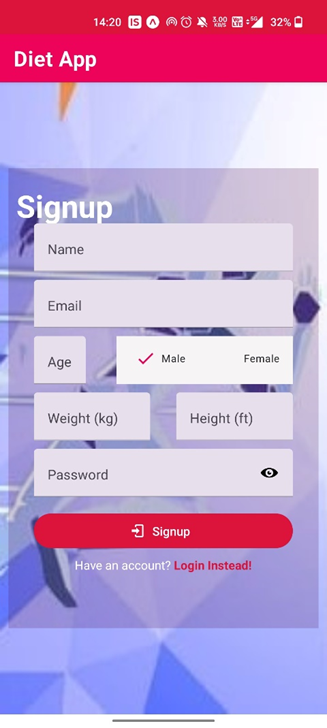

This project is built on React-Native (Expo Go) and Express.js.

## To run the project first:

1.  Install Node.js and npm (if you haven't already).
2.  Install Expo Go by running `npm install -g expo-cli` in your terminal.
3.  Clone the repository and navigate to the `backend` directory.
4.  Run `npm install` to install all dependencies.
5.  Create a new project in MongoDB.
6.  Create a `.env` file in the `backend` directory with the following variables: `MONGO_URI` and `PORT`
7.  Assign the obtained url from MongoDB to `MONGO_URI` and initialize `PORT` to 5000.

    ### Example:

         MONGO_URI="url_from_mongodb"
         PORT=5000

8.  Run `npm start` to start the server.
9.  Open another terminal and navigate to the `frontend` directory.
10. Run `npm install` to install all dependencies.
11. Navigate to `src/API/Server.js`.
12. Enter your current IP address at the designated location.
    You can obtain your IP(v4) address by running the command `ipconfig` in the terminal.
13. Run `npm start` to start the Expo Go development server.
14. Open the Expo Go app on your mobile device and scan the QR code displayed in the terminal

Note: Make sure you have Expo Go installed on your mobile device and you are connected to the same
network as your development machine.

## Snapshots:

